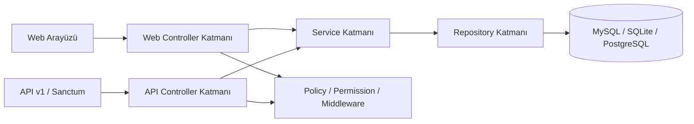

# Lohusa ve Bebek İzlem Platformu

Modern Laravel 12 altyapısı üzerine kurulu bu uygulama, lohusa ve bebek izlemlerini tek panelde toplayan; rol bazlı yetkilendirme, REST API, PDF çıktı, test otomasyonu ve Docker geliştirme ortamı sunan kapsamlı bir sağlık takip projesidir.

## Genel Bakış

> Klinik akışı destekleyen web paneli + API + yetkilendirme + test altyapısı.

### Öne çıkan yetenekler

- Lohusa ve bebek kayıtlarını ayrı modüller halinde yönetir.
- Spatie Permission ile `admin`, `ebe`, `student` rollerini destekler.
- Laravel Sanctum ile token tabanlı API erişimi sağlar.
- Lohusa kayıtları için çok adımlı form ve tarayıcı taslak kaydı sunar.
- PDF dışa aktarma ile saha çıktısı üretir.
- Pest testleri ve CI akışı ile kalite kontrolü hedefler.
- Docker Compose ile yerel geliştirme kurulumunu kolaylaştırır.

## Mimari



## Modüller

### 1. Dashboard
- Toplam kayıt, yaklaşan takip ve kalite göstergelerini sunar.
- Yaklaşan lohusa ve bebek kontrollerini öne çıkarır.
- Beslenme ve termin dağılımı gibi özet metrikler gösterir.

### 2. Lohusa izlem modülü
- Çok adımlı kayıt akışı içerir.
- Klinik, psikolojik ve sosyal alanları birlikte toplar.
- Takip önerisi ve tamamlılık puanı üretir.
- PDF raporu oluşturur.

### 3. Bebek izlem modülü
- Klinik muayene ve gelişim alanlarını kayıt altına alır.
- İzlem sayısına göre sonraki kontrol tarihini hesaplar.
- Listeleme, filtreleme, düzenleme ve PDF alma desteklenir.

### 4. API katmanı
- `POST /api/v1/auth/token` ile token üretir.
- Lohusa ve bebek kaynakları için CRUD uçları sağlar.
- `auth:sanctum` ile korunur.
- JsonResource ile düzenli çıktı üretir.

## Teknoloji yığını

- PHP 8.2
- Laravel 12
- Laravel Sanctum
- Spatie Laravel Permission
- Barryvdh DomPDF
- Pest
- Bootstrap 5
- Docker Compose

## Kurulum

### Yerel geliştirme

```bash
git clone https://github.com/ferhatolmez/LohusaVeBebekLaravel.git
cd LohusaVeBebekLaravel
cp .env.example .env
composer install
php artisan key:generate
php artisan migrate --seed
npm install
npm run build
php artisan serve
```

### Docker ile çalıştırma

```bash
docker compose up --build
```

Servisler:
- Web: `http://localhost:8080`
- MySQL: `127.0.0.1:33060`

## Demo kullanıcılar

- `admin@example.com` / `password`
- `ebe@example.com` / `password`
- `student@example.com` / `password`

## API örnekleri

### Token alma

```bash
curl -X POST http://127.0.0.1:8000/api/v1/auth/token \
  -H "Accept: application/json" \
  -d "email=ebe@example.com" \
  -d "password=password" \
  -d "device_name=postman"
```

### Lohusa kayıtlarını listeleme

```bash
curl http://127.0.0.1:8000/api/v1/lohusa \
  -H "Authorization: Bearer <TOKEN>" \
  -H "Accept: application/json"
```

### Bebek kaydı oluşturma

```bash
curl -X POST http://127.0.0.1:8000/api/v1/bebek \
  -H "Authorization: Bearer <TOKEN>" \
  -H "Accept: application/json" \
  -d "dogum_tarihi=2025-01-15" \
  -d "kac_haftalik=40" \
  -d "muayene_tarihi=2025-01-20" \
  -d "izlem_sayisi=1" \
  -d "termin_durumu=Term" \
  -d "cinsiyet=Erkek"
```

## Kalite süreçleri

```bash
composer lint
composer test
```

Notlar:
- Testlerin tam çalışması için PHP tarafında `pdo_sqlite` uzantısı etkin olmalıdır.
- PDF üretimi için DomPDF, Türkçe karakter desteğiyle `DejaVu Sans` kullanır.
- `RolePermissionSeeder` demo roller ve kullanıcıları üretir.

## Dağıtım

### Render
- Kök dizindeki `Dockerfile` Render için uygundur.
- [render.yaml](render.yaml) PostgreSQL tabanlı örnek servis tanımı içerir.
- Dağıtım sonrası `APP_KEY`, `APP_URL` ve veritabanı değişkenleri ayarlanmalıdır.

### CI
- Composer bağımlılıkları yüklenir.
- Frontend build alınır.
- Pint kontrolü çalıştırılır.
- Testler tetiklenir.

## Dizin yapısı

```text
app/
  Http/
    Controllers/
    Requests/
    Resources/
  Models/
  Policies/
  Repositories/
  Services/
resources/
  views/
routes/
tests/
```

## Ekran görüntüsü önerileri

README içine ileride şu ekran görüntüleri eklenebilir:
- Giriş ekranı
- Dashboard
- Lohusa kayıt listesi
- Bebek kayıt listesi
- Lohusa form akışı

## Lisans

MIT
