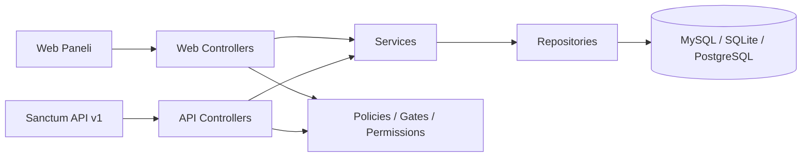

# Lohusa ve Bebek Izlem Platformu

[](https://github.com/ferhatolmez/LohusaVeBebekLaravel/actions/workflows/tests.yml)

Laravel 12 tabanli bu portfoy projesi, lohusa ve bebek izlemlerini tek panelde toplar. Uygulama artik sadece web formu sunan bir CRUD degil; rol bazli erisim kontrolu, Sanctum ile token tabanli REST API, Pest testleri, CI pipeline'i ve Docker gelistirme ortami ile birlikte gercek dunya Laravel uygulamasi formatina tasinmistir.

## Canli Kullanim

- Web paneli: Render deploy sonrasi servis URL'niz
- API tabani: `https://<render-servis-url>/api/v1`
- Demo kullanicilar:
  - `admin@example.com` / `password`
  - `ebe@example.com` / `password`
  - `student@example.com` / `password`

## Portfoyde One Cikanlar

- Laravel Sanctum ile versioned REST API: `POST /api/v1/auth/token`, `GET /api/v1/lohusa`, `POST /api/v1/bebek`
- Spatie Laravel Permission ile `admin`, `ebe`, `student` rolleri
- Policy + Gate + middleware birlikte kullanilan authorization katmani
- Repository ve Service pattern ile inceltilmis controller yapisi
- Pest ile web, API ve authorization odakli testler
- GitHub Actions CI: asset build, Pint, migration, test, coverage gate
- Docker Compose ile `app + nginx + mysql` gelistirme ortami

## Teknik Mimari



## Uygulama Modulleri

### 1. Web paneli
- Session auth ile korunan dashboard
- Lohusa ve bebek kayit listeleri
- PDF export, filtreleme, pagination
- Rol bazli aksiyonlar: ogrenci sadece okuyabilir, ebe veri girebilir/guncelleyebilir, admin tum islemleri yapabilir

### 2. REST API
- Token uretme: `POST /api/v1/auth/token`
- Lohusa resource: `index`, `store`, `show`, `update`, `destroy`
- Bebek resource: `index`, `store`, `show`, `update`, `destroy`
- JsonResource ile standardize response yapisi
- `auth:sanctum` ile korunan endpointler

### 3. Authorization katmani
- Middleware ile route korumasi
- `App\Policies\LohusaFormPolicy`
- `App\Policies\BebekFormPolicy`
- `Gate::define('viewDashboard')`
- Spatie permission seeder ile demo roller ve izinler

### 4. Mimari katmanlar

```text
app/
  Http/
    Controllers/
      Api/V1/
      Auth/
  Policies/
  Repositories/
  Services/
  Models/
```

## API Ozet Dokumani

### Token alma
```bash
curl -X POST http://127.0.0.1:8000/api/v1/auth/token \
  -H "Accept: application/json" \
  -d "email=ebe@example.com" \
  -d "password=password" \
  -d "device_name=postman"
```

### Lohusa listeleme
```bash
curl http://127.0.0.1:8000/api/v1/lohusa \
  -H "Authorization: Bearer <TOKEN>" \
  -H "Accept: application/json"
```

### Bebek kaydi ekleme
```bash
curl -X POST http://127.0.0.1:8000/api/v1/bebek \
  -H "Authorization: Bearer <TOKEN>" \
  -H "Accept: application/json" \
  -d "dogum_tarihi=2025-01-15" \
  -d "kac_haftalik=40" \
  -d "muayene_tarihi=2025-01-20" \
  -d "izlem_sayisi=1" \
  -d "termin_durumu=Term" \
  -d "cinsiyet=Erkek" \
  -d "kacinci_cocuk=1" \
  -d "kan_grubu=A Rh+" \
  -d "ates=36.5" \
  -d "nabiz=120" \
  -d "solunum=40" \
  -d "kilo=3.2" \
  -d "boy=50" \
  -d "bas_cevresi=34" \
  -d "gogus_cevresi=32"
```

## Kurulum

### Lokal gelistirme
```bash
git clone https://github.com/ferhatolmez/LohusaVeBebekLaravel.git
cd LohusaVeBebekLaravel
cp .env.example .env
composer install
php artisan key:generate
php artisan migrate --seed
npm install
npm run build
php artisan serve
```

### Docker Compose
```bash
docker compose up --build
```

Docker ortaminda servisler:
- App: PHP-FPM / Laravel
- Nginx: `http://localhost:8080`
- MySQL: `127.0.0.1:33060`

## Kalite ve Test

```bash
composer lint
composer test
php artisan test --coverage --min=80
```

Kapsanan senaryolar:
- Login ve dashboard erisim kontrolu
- Web form create/update davranislari
- Student/ebe/admin authorization farklari
- Sanctum token issuance
- API read/write yetki kontrolleri
- Follow-up ve completion score unit testleri

## Deploy

### Render
- Root `Dockerfile` Render icin hazirdir
- `render.yaml` PostgreSQL tabanli deploy tanimi icerir
- Deploy sonrasi `APP_KEY`, `APP_URL` ve veritabani degiskenlerini Render ortaminda tanimlayin

### GitHub Actions
Pipeline sirasiyla su adimlari calistirir:
1. Composer install
2. NPM install ve production build
3. SQLite migration
4. Pint lint kontrolu
5. Pest test suite
6. Coverage raporu ve minimum coverage gate

## Ekran Goruntuleri

README'ye GitHub `assets/` veya `docs/` altina eklenecek ekran goruntuleriyle su bloklari koyabilirsiniz:
- Login ekrani
- Dashboard
- Lohusa liste ekrani
- Bebek formu
- API response ornegi

## Varsayimlar ve Notlar

- Yerel makinede `pdo_sqlite` kurulu degilse testler calismayabilir; CI pipeline SQLite ile bunu dogrular.
- `RolePermissionSeeder` demo kullanicilari olusturur.
- Form validation ve API validation ayni request siniflari uzerinden ilerler.

## Lisans

MIT
